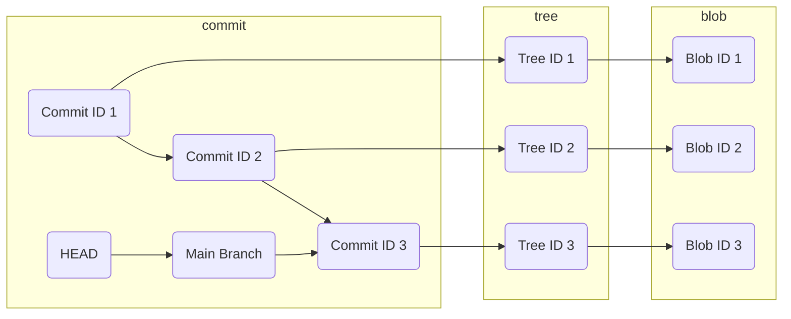

```mermaid
graph LR;

  subgraph commit
    commitID1(Commit ID 1)
    commitID2(Commit ID 2)
    commitID3(Commit ID 3)
    mainBranch(Main Branch)
    HEAD(HEAD)
  end

  subgraph tree
    treeID1(Tree ID 1)
    treeID2(Tree ID 2)
    treeID3(Tree ID 3)
  end

  subgraph blob
    blobID1(Blob ID 1)
    blobID2(Blob ID 2)
    blobID3(Blob ID 3)
  end

  commitID1 --> treeID1
  treeID1 --> blobID1
  commitID2 --> treeID2
  treeID2 --> blobID2
  commitID3 --> treeID3
  treeID3 --> blobID3

  commitID1 --> commitID2
  commitID2 --> commitID3

  mainBranch --> commitID3
  HEAD --> mainBranch

```