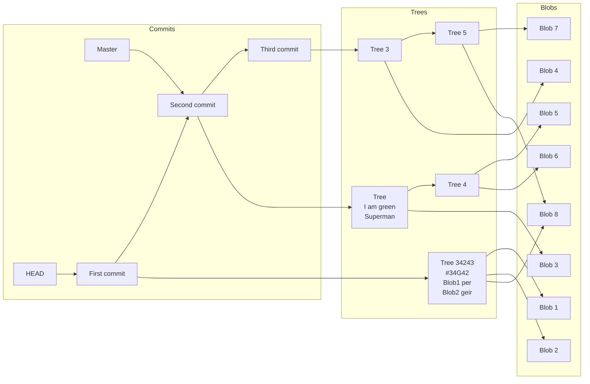

```mermaid

graph LR

H[HEAD]
M[Master]

T1[Tree 34243<br>#34G42<br>Blob1 per <br>Blob2 geir]

T2[Tree <br>I am green<br>Superman]

subgraph Commits
H --> A
M --> B
A[First commit] --> B[Second commit]
B --> C[Third commit]
end
subgraph Trees
A --> T1
B --> T2
C --> T3[Tree 3]
T2 --> T4[Tree 4]
T3 --> T5[Tree 5]
end
subgraph Blobs
T1 --> B1[Blob 1]
T1 --> B2[Blob 2]
T2 --> B3[Blob 3]
T4 --> B5[Blob 5]
T4 --> B6[Blob 6]
T3 --> B4[Blob 4]
T5 --> B7[Blob 7]
T1 --> B8[Blob 8]
T5 --> B8[Blob 8]
end


```

